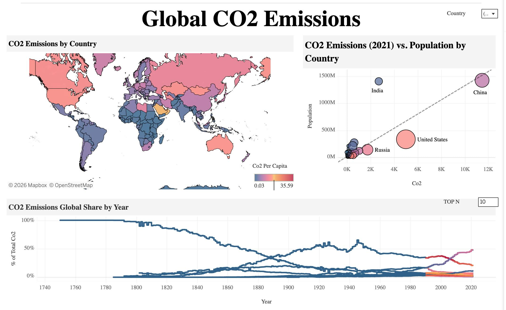
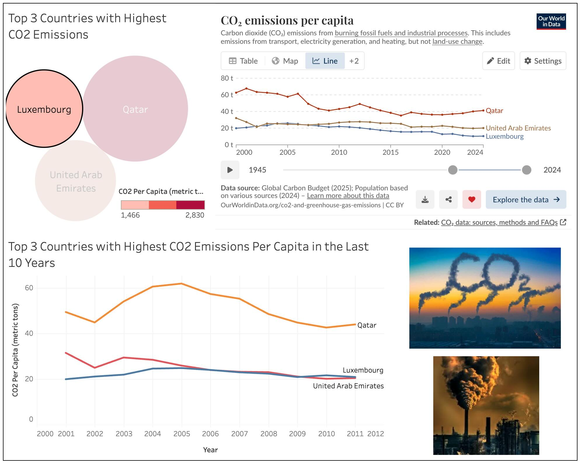

# Data Visualization

## Assignment 2: Good and Bad Data Visualization

### Requirements:

- Data visualizations are important tools for communication and convincing; we need to be able to evaluate the ways that data are presented in visual form to be critical consumers of information 
- To test your evaluation skills, locate two public data visualizations online, one good and one bad  
    - You can find data visualizations at https://public.tableau.com/app/discover or https://datavizproject.com/, or anywhere else you like! 
- For each visualization (good and bad):  
    - Explain (with reference to material covered up to date, along with readings and other scholarly sources, as needed) why you classified that visualization the way you did.

---

### Good Visualization

Link: [https://public.tableau.com/app/profile/chris.kong1718/viz/GlobalCO2EmissionsDashboard_17455493859290/Dashboard1](https://public.tableau.com/app/profile/chris.kong1718/viz/GlobalCO2EmissionsDashboard_17455493859290/Dashboard1)

Why this is a good visualization:

**1. Purposeful Layout and Data Storytelling:**

The dashboard integrates three coordinated views: a choropleth world map (CO₂ per capita by country), a scatterplot (CO₂ vs population), and a time-series chart (global share over time). These views work together to tell a broader story about emissions distribution, country comparison, and historical change. The layout supports both overview and deeper analysis.

**2. Appropriate Chart Selection:**

The map is appropriate for geographic distribution. The scatterplot uses aligned axes to compare emissions and population; outliers are labeled directly such as China, India, and the United States, reducing the need to search through a legend. The line chart effectively communicates long-term trends. Each chart type matches its analytical purpose.

**3. Visual Hierarchy and Clarity:**

The large, clear title anchors the dashboard. The map appears first as the overview, followed by comparative and trend views. Axes and legends are labeled, and the color scale clearly indicates CO₂ per capita levels. This supports quick interpretation without guesswork.

**4. Meaningful Use of Colour:**

The choropleth uses a continuous colour scale to represent magnitude differences. The legend clearly communicates the range, helping viewers interpret intensity accurately.

### Bad Visualization

Link: [https://public.tableau.com/app/profile/rahmat.fadhilah.gumelar/viz/CO2EMISSIONS_17186809104440/3CountrieswithHighestCO2Emissions](https://public.tableau.com/app/profile/rahmat.fadhilah.gumelar/viz/CO2EMISSIONS_17186809104440/3CountrieswithHighestCO2Emissions)

Why this is a bad visualization:

**1. Ineffective Chart Choice (Bubble Chart for Comparison):**

The top-left bubble chart uses circle size to represent CO₂ per capita for the top three countries. Comparing area is much less precise than comparing bar lengths or aligned positions. Viewers cannot easily determine how much larger Qatar’s emissions are relative to Luxembourg’s or UAE. Additionally, the legend shows a scale range (1,466 to 2,830) without clear units or explanation.

**2. Redundant Line Charts Showing the Same Information:**

There are two separate line charts displaying CO₂ emissions per capita for the same three countries (Qatar, Luxembourg, and the UAE). Although the colors differ slightly between the views, they present essentially the same trend data (adjusting the slider in the top-right chart to the same period would show the same information as the bottom chart). This redundancy does not add new insight. Instead, it increases cognitive load and forces viewers to process duplicate information. Effective visualization should eliminate repetition unless it serves a clear comparative purpose.

**3. Inconsistent Styling and Colour Encoding:**

Different sections use different fonts, styles, and colour schemes. Colors are not consistently mapped across charts. For example, Qatar is shown in red in the top-right chart but appears in orange in the bottom chart; the same inconsistency applies to the other two countries. Without consistent visual encoding, interpretation becomes more difficult.

**4. Decorative Images Reduce Data Focus:**

The inclusion of large pollution images adds emotional context but does not encode data. These visuals consume significant space and distract from the quantitative charts. This shifts attention away from analysis.

---

- How could this data visualization have been improved?  

---

### For the Good visualization example

- Add annotations highlighting key turning points in the time-series chart.

- Emphasize top contributors more clearly in the global share line chart to reduce clutter.

### For the Bad visualization example

- Replace the bubble chart with a simple bar chart for clearer comparison.

- Remove one of the redundant line charts and keep a single clear trend view.

- Eliminate decorative images that do not encode data.

- Use consistent color mapping and font style across all charts.

- Add a clear title explaining the analytical purpose

---

- Word count should not exceed (as a maximum) 500 words for each visualization (i.e. 
300 words for your good example and 500 for your bad example)

### Why am I doing this assignment?:

- This assignment ensures active participation in the course, and assesses the learning outcomes
* Apply general design principles to create accessible and equitable data visualizations
* Use data visualization to tell a story

### Rubric:

| Component               | Scoring   | Requirement                                                 |
|-------------------------|-----------|-------------------------------------------------------------|
| Data viz classification and justification | Complete/Incomplete | - Data viz are clearly classified as good or bad - At least three reasons for each classification are provided - Reasoning is supported by course content or scholarly sources |
| Suggested improvements  | Complete/Incomplete | - At least two suggestions for improvement - Suggestions are supported by course content or scholarly sources |

## Submission Information

🚨 **Please review our [Assignment Submission Guide](https://github.com/UofT-DSI/onboarding/blob/main/onboarding_documents/submissions.md)** 🚨 for detailed instructions on how to format, branch, and submit your work. Following these guidelines is crucial for your submissions to be evaluated correctly.

### Submission Parameters:
* Submission Due Date: `23:59 - 02/16/2026`
* The branch name for your repo should be: `assignment-2`
* What to submit for this assignment:
    * This markdown file (assignment_2.md) should be populated and should be the only change in your pull request.
* What the pull request link should look like for this assignment: `https://github.com/<your_github_username>/visualization/pull/<pr_id>`
    * Open a private window in your browser. Copy and paste the link to your pull request into the address bar. Make sure you can see your pull request properly. This helps the technical facilitator and learning support staff review your submission easily.

Checklist:
- [ ] Create a branch called `assignment-2`.
- [ ] Ensure that the repository is public.
- [ ] Review [the PR description guidelines](https://github.com/UofT-DSI/onboarding/blob/main/onboarding_documents/submissions.md#guidelines-for-pull-request-descriptions) and adhere to them.
- [ ] Verify that the link is accessible in a private browser window.

If you encounter any difficulties or have questions, please don't hesitate to reach out to our team via our Slack. Our Technical Facilitators and Learning Support staff are here to help you navigate any challenges.
