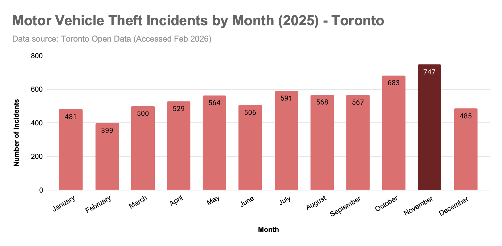
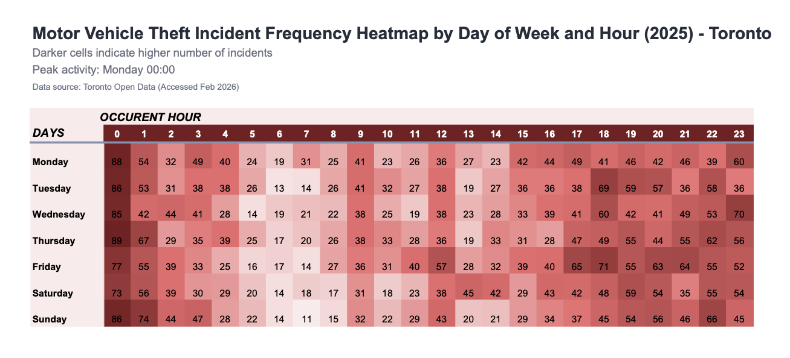

# Data Visualization

## Assignment 3: Final Project

### Google Sheets Visualization

**Data source**: Toronto Open Data - [Theft from Motor Vehicle](https://open.toronto.ca/dataset/theft-from-motor-vehicle/)

This project visualizes **Motor Vehicle Theft incidents in the City of Toronto** using the most recent complete year of data (2025). The goal is to provide relevant, accessible information to raise awareness in the community — particularly for individuals who own motor vehicles and live in, work in, or park in Toronto.

The dataset was filtered to include incidents occurring in 2025 only, ensuring a complete and unbiased yearly comparison.

Two visualizations were created:

- A bar chart showing total incidents by month.

- A heatmap showing incident frequency by day of week and hour.

The charts are available in the shared Google Sheets document: [here](https://docs.google.com/spreadsheets/d/1q4UEF3GNafw38eZN8DPRu5GebDM7QmUgSueZXO_h_do/edit?usp=sharing)

### **I. Motor Vehicle Theft Incidents by Month**

This bar chart provides an overview of seasonal patterns. November recorded the highest number of incidents in 2025, followed by a noticeable decline during the winter months.

The chart allows viewers to quickly compare monthly totals and identify peak periods of risk.

### **II. Motor Vehicle Theft Incident Frequency by Day of Week and Hour**

The heatmap provides more granular insight into when incidents most frequently occur. Peak activity consistently occurs around **00:00** (midnight), with **Thursday** showing particularly high counts. The lowest frequency of incidents occurs between **5:00 and 8:00 AM** across most days.

The heatmap allows viewers to detect temporal patterns at a glance and understand both daily and hourly risk concentration.

### Assigment Questions:

**What software did you use to create your data visualization?**

The visualizations were created using **Google Sheets** (pivot tables, bar charts, and conditional formatting for the heatmap).

**Who is your intended audience?**

The intended audience is the Toronto community, especially motor vehicle owners and individuals who regularly park vehicles in the city.

**What information or message are you trying to convey with your visualization?**

The visualizations communicate:

- Which months experience the highest number of motor vehicle theft incidents.

- Which days and hours show peak activity.

- When risk is lowest.

The goal is to support awareness and encourage preventative decision-making (e.g., being more cautious during higher-risk time periods).

**What aspects of design did you consider when making your visualization? How did you apply them? With what elements of your plots?**

Several design principles guided these visualizations. First, clarity and reduced cognitive load were prioritized by using a simple bar chart for monthly comparisons and a structured heatmap matrix (day x hour) for temporal patterns. Position along a common scale was used in the bar chart to allow accurate comparison of monthly totals. In the heatmap, spatial layout and color intensity encode frequency, with darker red indicating higher incident counts. Visual hierarchy was established through clear titles, subtle gridlines, balanced spacing, and equal cell sizing, ensuring the main insights stand out without unnecessary visual distraction.

**How did you ensure that your data visualizations are reproducible? If the tool you used to make your data visualization is not reproducible, how will this impact your data visualization?**

The data were preprocessed using Python. The workflow included:

- Downloading raw data from Toronto Open Data.

- Removing null values.

- Extracting relevant features.

- Filtering to include only 2025 incidents.

- Exporting the cleaned dataset as a CSV file.

The CSV file was then uploaded into Google Sheets to construct pivot tables and generate the bar chart and heatmap.

Because the data source is public and the preprocessing steps are documented, the visualizations can be reproduced using the same dataset and pivot table structure.

**How did you ensure that your data visualization is accessible?**

Accessibility considerations included:

- High contrast between text and background.

- Clear labeling of axes and categories.

- Equal cell sizing in the heatmap for readability.

- Use of color intensity (not color hue alone) to encode magnitude.

**Who are the individuals and communities who might be impacted by your visualization?**

The Toronto community, especially:

- Motor vehicle owners

- Residents

- Commuters

- Individuals parking vehicles overnight

The visualization aims to inform and promote preventative awareness.

**How did you choose which features of your chosen dataset to include or exclude from your visualization?**

The intention was to present the most recent complete trend.

Although data were available for early 2026, including partial-year data would bias January and February totals. To prevent distortion in month-by-month comparisons, the dataset was restricted to the complete 2025 calendar year.

This ensures fair comparison across months and a reliable representation of recent trends.

**What "underwater labour" contributed to your final data visualization product?**

- Data cleaning and preprocessing in Python.

- Feature extraction (month, day of week, hour).

- Construction of pivot tables.

- Adjusting formatting, cell sizing, and conditional color scales.

- Iteratively refining layout, margins, and annotations.
