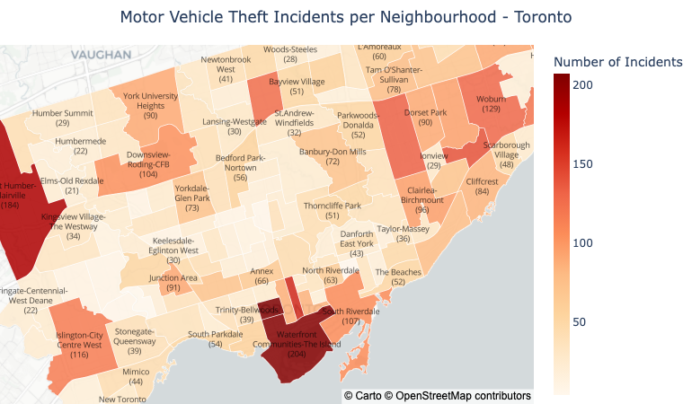
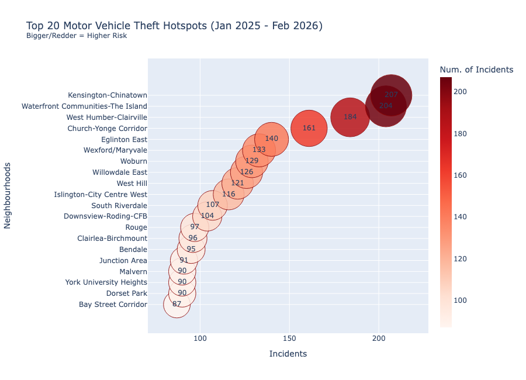
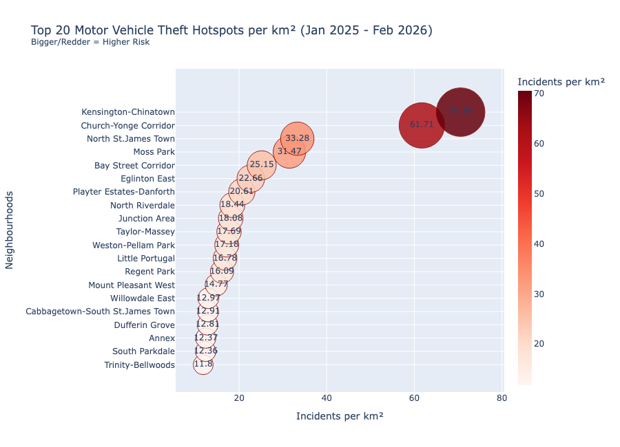

## Assignment 3: Final Project

### Python (Plotly) Visualization

**Data source**: Toronto Open Data - [Theft from Motor Vehicle](https://open.toronto.ca/dataset/theft-from-motor-vehicle/)

**Geopatial data source**: GeoJSON - [GeoJSON](https://github.com/jasonicarter/toronto-geojson/raw/master/toronto_crs84.geojson) 

This project visualizes **Motor Vehicle Theft incidents in the City of Toronto** using **Python and Plotly**. The goal is to provide clear, spatial, and comparative insights to raise awareness in the community - particularly for motor vehicle owners who live in, work in, or park within Toronto.

The notebook uses preprocessed data generated from `preprocessing.ipynb`, where raw data were cleaned, filtered to 2025 incidents, and merged with neighbourhood geographic boundaries.

This notebook produces three main visualizations:

- A choropleth (density) map showing the number of incidents per neighbourhood.

- A bubble scatter plot of the Top 20 neighbourhoods with the highest total incidents.

- A bubble scatter plot of the Top 20 neighbourhoods ranked by incidents per km² (incident density).

### I. Choropleth Map - Incidents per Neighbourhood

The choropleth map provides a city-wide overview of motor vehicle theft distribution across Toronto neighbourhoods. Clear spatial clustering is visible.

Neighbourhoods such as **Kensington–Chinatown**, **Waterfront Communities–The Island**, and **West Humber–Clairville** show the highest total incident counts, standing out in darker shades. 

In contrast, many peripheral residential neighbourhoods show significantly lower incident totals, indicating uneven spatial concentration rather than uniform city-wide risk.

Overall, the map confirms that motor vehicle theft is geographically concentrated in specific urban corridors rather than randomly distributed.

### II. Top 20 Motor Vehicle Theft Hotspots (Total Incidents)

The Top 20 scatter plot highlights absolute incident counts by neighbourhood.  
**Kensington–Chinatown ranks #1**, followed closely by **Waterfront Communities-The Island**, with other neighbourhoods shifting slightly in position compared to the density ranking.

This ranking reflects raw exposure: areas with high population density, tourism, mixed commercial-residential use, and major road access naturally record more theft incidents.

The dominance of downtown-adjacent neighbourhoods suggests opportunity-driven crime patterns tied to vehicle availability and activity intensity.

### III. Top 20 Hotspots per km² (Incident Density)

When adjusting for land area, the ranking shifts slightly, but **Kensington–Chinatown remains #1**, reinforcing that it is not only high in total incidents but also extremely concentrated spatially.

Neighbourhoods that move up in the density ranking tend to be:

- Smaller in geographic size  
- Highly urbanized  
- Mixed-use with heavy pedestrian and vehicle turnover  

This metric reveals intensity rather than volume. Some large-area neighbourhoods with high totals drop in ranking once normalized by size, indicating that incidents are more dispersed there.

### Assigment Questions:

**What software did you use to create your data visualization?**

The visualizations were created using Python with Plotly Express for interactive plotting.
Geographic data were merged using GeoPandas, and preprocessing was conducted in a separate Python notebook (`preprocessing.ipynb`).

**Who is your intended audience?**

The intended audience is the Toronto community, particularly:

- Motor vehicle owners

- Residents

- Commuters

- Individuals parking vehicles overnight

The visualizations aim to inform preventative awareness.

**What information or message are you trying to convey?**

The visualizations communicate:

- Where motor vehicle theft is geographically concentrated.

- Which neighbourhoods experience the highest total incidents.

- Which neighbourhoods have the highest theft density relative to area.

By combining spatial and comparative views, the project highlights both volume-based hotspots and density-based risk areas.

**What aspects of design did you consider when making your visualization? How did you apply them? With what elements of your plots?**

Clarity and perceptual accuracy were primary considerations. Position along a common scale was used in both scatter plots to enable accurate comparison of incident counts and densities. Color intensity (red scale) encodes magnitude consistently across visualizations, reinforcing risk interpretation. Bubble size provides redundant encoding to strengthen visual emphasis. In the choropleth map, spatial position represents neighbourhood geography while color intensity reflects incident volume, enabling rapid pattern recognition. Titles, subtitles, and margins were structured to establish visual hierarchy and minimize cognitive load.

**How did you ensure that your data visualizations are reproducible?**

Reproducibility was ensured by:

- Downloading raw data from Toronto Open Data.

- Cleaning and preprocessing data in preprocessing.ipynb.

- Filtering to include 2025 incidents only.

- Merging with official neighbourhood geographic boundaries.

- Performing all aggregation and plotting programmatically in Python.

Because the workflow is scripted, anyone with the dataset and notebook can reproduce the exact visualizations.

**How did you ensure that your data visualization is accessible?**

Accessibility considerations included:

- High contrast between text and background.

- Clear axis labels and titles.

- Consistent red color scale to indicate intensity.

- Avoidance of excessive decorative elements.

- Use of both size and color to encode magnitude (redundant encoding).

**Who are the individuals and communities impacted?**

The Toronto community, particularly individuals whose daily routines involve parking vehicles in higher-risk neighbourhoods. The visualization may also inform local awareness and public safety discussions.

**How did you choose which features of your dataset to include or exclude?**

The dataset was restricted to 2025 to ensure a complete and unbiased annual comparison. Partial 2026 data were excluded to prevent distortion in monthly or neighbourhood-level totals. The focus was placed on neighbourhood-level aggregation and incident density to balance geographic and comparative perspectives.

**What "underwater labour" contributed to your final product?**

- Cleaning and filtering raw incident data.

- Extracting temporal and geographic features.

- Merging incident data with neighbourhood polygon shapefiles.

- Calculating incident counts and densities.

- Ranking neighbourhoods.

- Iteratively adjusting color scales, margins, annotations, and layout in Plotly.